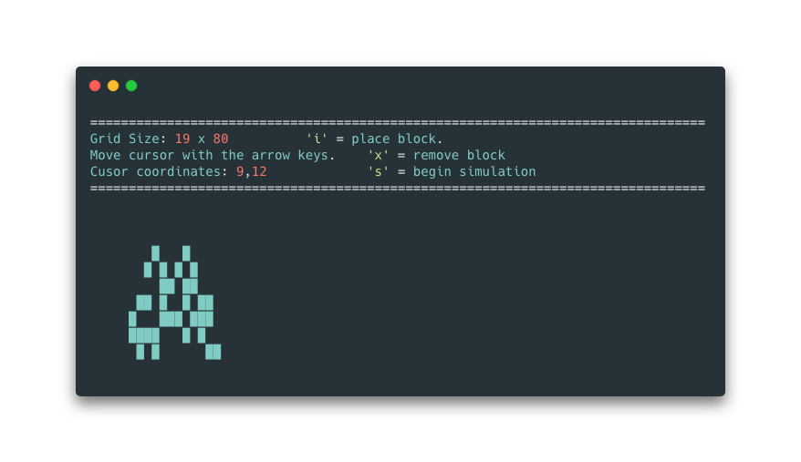

# terminal-GOL


A terminal implementation of John Conway's cellular automaton, [ the Game of Life](https://en.wikipedia.org/wiki/Conway%27s_Game_of_Life). From Wikipedia:
>One interacts with the Game of Life by creating an initial configuration and observing how it evolves, or, for advanced players, by creating patterns with particular properties.

## Installation
### Brew:
```bash
brew tap k-vernooy/tap  
brew install terminalGOL
```
### Git:
```bash
git clone "https://github.com/k-vernooy/terminal-GOL"  && cd "terminal-GOL"  
make  
make install  
```

## Usage
After installation the program can then be run with the command `terminalGOL`.
When run with no arguments, it enters interactive mode.

### Interactive interface:
`i` to place a block  
`x` to remove a block  
`s` to begin simulation  


## Compatability
Should be compatible with any OS, but as of now has only been tested on macOS.

## Images

